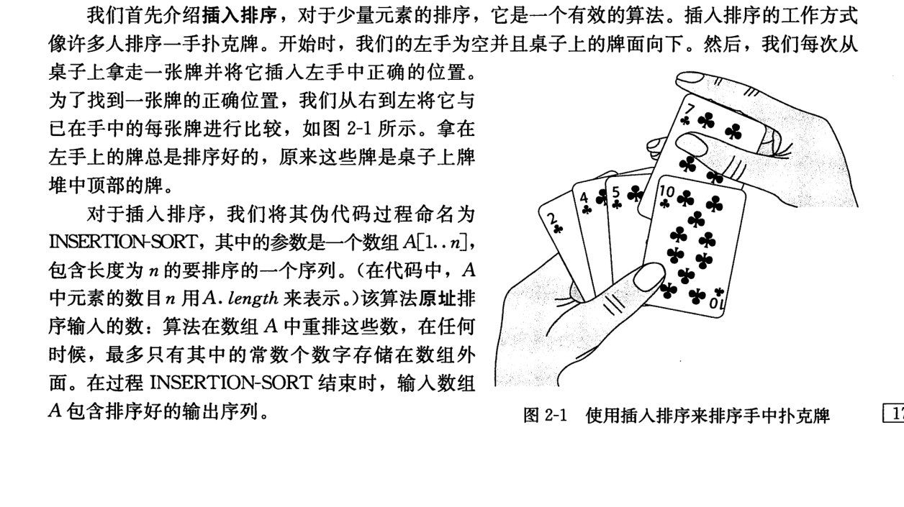

### 插入排序

---------------------------------------
原理: 假设桌上有5张牌, 现在每次从桌上抽一张牌至于左手中。第一张牌直接抽出；第二张牌抽出时和第一张牌比较大小，如果比第一张牌小则交换一二张牌位置；第三张牌抽出, 用第三张牌逐个和之前第二张，第一张比较，如果小于对应的排，则将对应牌和他后面一张的卡牌交换顺序，直到第一次发现对应的那张卡牌小于当前(第三次抽到的这张牌)为止。

